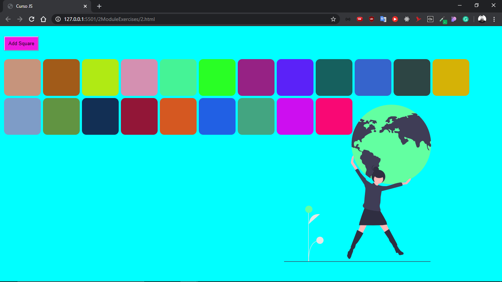
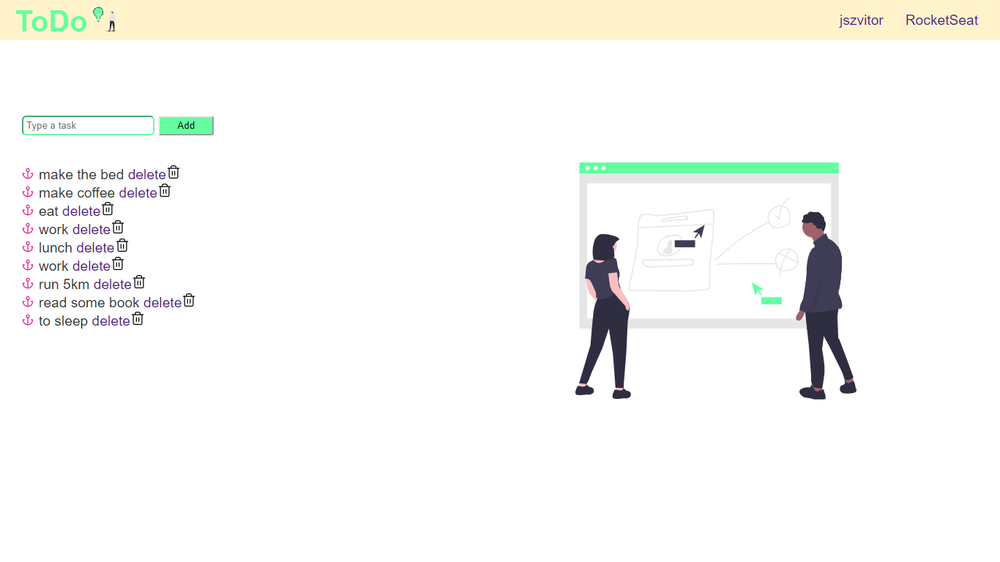

# [JavaScript RocketSeat Course](https://skylab.rocketseat.com.br/journey/starter) [](https://rocketseat.com.br)

<div>
  
  <a href="https://jszvitor.github.io">
    
  </a>
  <a href="https://github.com/jszvitor">
    
  </a>
</div>

<h1 align="center">
  
</h1>
<p>
  This repository haven the final exercises for each module of the RocketSeat Javascript course.
  You can access this course in that link: https://skylab.rocketseat.com.br/journey/starter
<p>

## Módulo 01

<h3> 1º exercício </h3>

Crie uma função que dado o objeto a seguir:

```js
var endereco = {
  rua: 'Rua dos pinheiros',
  numero: 1293,
  bairro: 'Centro',
  cidade: 'São Paulo',
  uf: 'SP'
};
```

Retorne o seguinte conteúdo:

```
O usuário mora em São Paulo / SP, no bairro Centro, na rua "Rua dos Pinheiros" com nº 1293.
```

<h3> 2º exercício </h3>

Crie uma função que dado um intervalo (entre x e y) exiba todos número pares:

```js
function pares(x, y) {
  // código aqui
}

pares(32, 321);
```

<h3> 3º exercício </h3>

Escreva uma função que verifique se o vetor de habilidades passado possui a habilidade "Javascript" e retorna um booleano ```true/false``` caso exista ou não.

```js
function temHabilidade(skills) {
  // código aqui
}

var skills = ['Javascript', 'ReactJS', 'React Native'];
temHabilidade(skills); // true ou false
```

_Dica: para verificar se um vetor contém um valor, utilize o método [indexOf](https://developer.mozilla.org/pt-BR/docs/Web/JavaScript/Reference/Global_Objects/Array/indexOf)._

<h3> 4º exercício </h3>

Escreva uma função que dado um total de anos de estudo retorna o quão experiente o usuário é:

```js
function experiencia(anos) {
  // código aqui
}

var anosEstudo = 7;
experiencia(anosEstudo);

// De 0-1 ano: Iniciante
// De 1-3 anos: Intermediário
// De 3-6 anos: Avançado
// De 7 acima: Jedi Master
```

<h3> 5º exercício </h3>

Dado o seguinte vetor de objetos:

```js
var usuarios = [
  {
    nome: 'Diego',
    habilidades: ['Javascript', 'ReactJS', 'Redux']
  },
  {
    nome: 'Gabriel',
    habilidades: ['VueJS', 'Ruby on Rails', 'Elixir']
  }
];
```

Escreva uma função que produza o seguinte resultado:

```
O Diego possui as habilidades: Javascript, ReactJS, Redux
O Gabriel possui as habilidades: VueJS, Ruby on Rails, Elixir
```

_Dica: Para percorrer um vetor você deve utilizar a sintaxe [for...of](https://developer.mozilla.org/pt-BR/docs/Web/JavaScript/Reference/Statements/for...of) e para unir valores de um array com um separador utilize o [join](https://developer.mozilla.org/pt-BR/docs/Web/JavaScript/Reference/Global_Objects/Array/join)._

<h3> 5º exercício (Desafio master, vai encarar?)</h3>

Em uma página crie uma função que dado um número de minutos crie um countdown em tempo real (de segundo a segundo) até chegar em zero no formato ```08:30:20```, por exemplo:

```js
function countdown(minutos) {
  // código aqui
}

countdown(70);

// 70 minutos equivalem a 1 hora e 10 minutos

// 01:10:00
// 01:09:59
// 01:09:58
// 01:09:57
// 01:09:56
```

_Dica: Para manipular datas e horários você pode utilizar a [classe Date do Javascript](https://developer.mozilla.org/pt-BR/docs/Web/JavaScript/Reference/Global_Objects/Date)._


## Módulo 02

<h3> 1º exercício</h3>

Crie um botão que ao ser clicado cria um novo elemento em tela com a forma de um quadrado vermelho com 100px de altura e largura. Sempre que o botão for clicado um novo quadrado deve aparecer na tela.

<h3> 2º exercício</h3>


Utilizando o resultado do primeiro desafio, toda vez que o usuário passar o mouse por cima de algum quadrado troque sua cor para uma cor aleatória gerada pela função abaixo:
```js
function getRandomColor() {
  var letters = '0123456789ABCDEF';
  var color = '#';
  for (var i = 0; i < 6; i++) {
    color += letters[Math.floor(Math.random() * 16)];
  }
  return color;
}

var newColor = getRandomColor(); // #E943F0
```

<h3> 3º exercício</h3>

A partir do seguinte vetor:

```js
var nomes = ['Diego', 'Gabriel', 'Lucas'];
```

Preencha uma lista (```<ul>```) no HTML com os itens da seguinte forma:

* Diego
* Gabriel
* Lucas

<h3> 4º exercício</h3>

Seguindo o resultado do exercício anterior adicione um input em tela e um botão como a seguir:

```html
<input type="text" name="nome">
<button onClick="adicionar()">Adicionar</button>
```

Ao clicar no botão, a função ```adicionar()``` deve ser disparada adicionando um novo item a lista de nomes baseado no nome preenchido no input e renderizando o novo item em tela juntos aos demais itens anteriores. Além disso, o conteúdo do input deve ser apagado após o clique.

<h3> 5º exercício  (Desafio master, vai encarar?)</h3>

Dado o seguinte vetor:

```js
var users = [
  {
    nome: 'Diego',
    idade: 23,
    sexo: 'M',
  },
  {
    nome: 'Gabriela',
    idade: 18,
    sexo: 'F',
  },
  {
    nome: 'José',
    idade: 30,
    sexo: 'M',
  },
  {
    nome: 'Maria',
    idade: 27,
    sexo: 'F',
  }
];
```

Exiba os dados em tela em forma de lista como a seguir e crie 3 botões abaixo:

```html
<ul>
  <li>Diego é homem e possui 23 anos</li>
  <li>Gabriela é mulher e possui 18 anos</li>
  <li>José é homem e possui 30 anos</li>
  <li>Maria é mulher e possui 27 anos</li>
</ul>

<button onClick="">Ordenar por nome</button>
<button onClick="">Ordenar por idade</button>

<button onClick="">Exibir apenas homens</button>
<button onClick="">Exibir apenas mulheres</button>
<button onClick="">Exibir todos</button>
```

Os dois primeiros botões devem ordenar a lista, por nome e por idade. Os outros 3 botões devem aplicar filtros na lista exibindo apenas homens, apenas mulheres ou todos. Lembrando que o filtro deve funcionar junto da ordenação então deve ser possível filtrar apenas homens e ordenar por idade.


## Módulo 03: ToDo



## Módulo 04

<h3> 1º exercício </h3>

Crie uma função que recebe a idade de um usuário e retorna uma Promise que depois de **2 segundos** retornará se usuário é maior ou não que 18 anos. Se o usuário ter mais que 18 anos de idade o resultado deve cair no ```.then```, caso contrário, no ```.catch```

```js
function checaIdade(idade) {
  // Retornar uma promise
}

checaIdade
  .then(...)
  .catch(...)
```

<h3> 2º exercício </h3>


Crie uma tela com um ```<input>``` que deve receber o nome de um usuário no Github. Após digitar o nome do usuário e clicar no botão buscar a aplicação deve buscar pela API do Github (conforme URL abaixo) os dados de repositórios do usuário e mostrá-los em tela:

```html
<input type="text" name="user">
<button onclick="">Adicionar</button>
```

Depois de preencher o input e adicionar, a seguinte lista deve aparecer abaixo:

```html
<ul>
  <li>repo1</li>
  <li>repo2</li>
  <li>repo3</li>
  <li>repo4</li>
  <li>repo5</li>
</ul>
```

<h3> 3º exercício </h3>

A partir do resultado do exemplo anterior adicione um indicador de carregamento em tela no lugar da lista apenas enquanto a requisição estiver acontecendo:

```html
<p>Carregando...</p>
```

Além disso, adicione uma mensagem de erro em tela caso o usuário no Github não exista.

_Dica: Quando o usuário não existe, a requisição irá cair no ```.catch``` com código de erro 404._